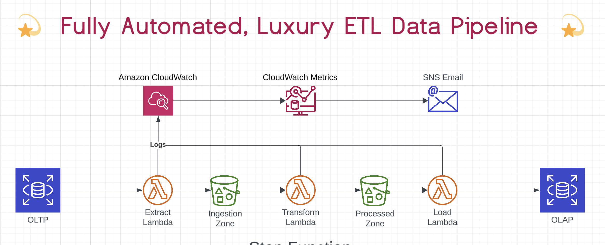
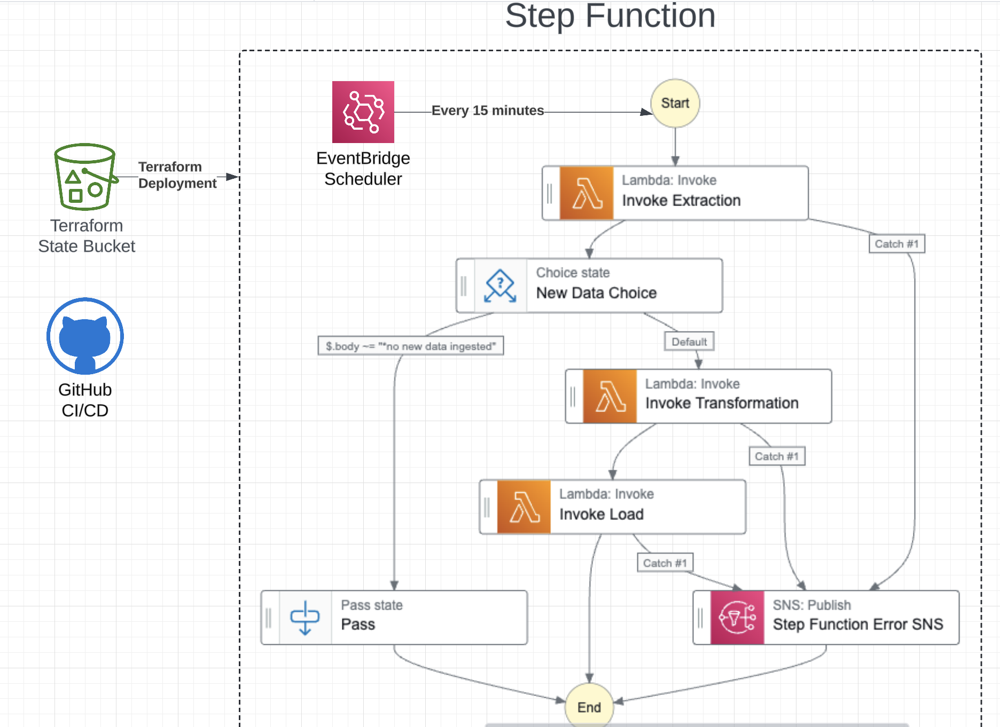

# Documentation

# Terraform 
Terraform is used to set up the configuration for deploying the AWS infrastructure, structured using modules.  The files are organized to manage different parts of the data pipeline, specifically focusing on extraction, transformation, and the setup of permanent resources.

## Main Files

### main.tf
The main.tf file sets up the modules and an s3 bucket that is used to contain a terraform state file that keeps track of the infrastructure managed by terraform
 

1. Terraform Configuration Block

	•	required_providers: Specifies the provider (aws) used in the configuration, pulling from the official HashiCorp registry with version constraints.

	•	backend “s3”: Configures Terraform to store the state file in an S3 bucket (smith-morra-terraform-state-bucket) in the eu-west-2 region. The state file (extraction_terraform.tfstate) keeps track of the infrastructure managed by Terraform. 

2. AWS Provider Configuration

3. Modules

    Permanent -  Manages resources that are expected to be long-lived, like S3 buckets for data ingestion and other shared infrastructure.

    Extraction - Manages the extraction phase of the ETL (Extract, Transform, Load) pipeline.

    Transformation - Manages the transformation phase of the ETL pipeline.
    load - manages the load phase of the ETL pipeline,

## Step Functions
Step Functions is a service that lets you coordinate multiple AWS services into serverless workflows.

### stepFunction.tf

Configuration for defining an AWS Step Functions state machine using the aws_sfn_state_machine resource.  Outlines how a state machine is set up to manage an ETL (Extract, Transform, Load) process. Also retry strategies and additional features such as a catch block to handle errors and publish messages to SNS

### stepFunction_scheduler.tf

set up a scheduler that triggers an AWS Step Function periodically using Amazon CloudWatch Events 

### stepFuntion_iam.tf

Sets up IAM role permisions for the stepFunction

### data.tf

several Terraform data sources and archive_file resources used in setting up AWS Lambda functions.

### outputs.tf

defines three output values that  can be used by other parts of the Terraform configuration or displayed to the user after an apply.  These outputs are essentially exporting the ARNs of the three S3 buckets (ingestion, transformation, and Lambda code) from the permanent module. This allows other parts of the Terraform configuration, or external tools, to reference these bucket ARNs easily. 

## Permanent Module

 ### s3.tf

  defines three AWS S3 buckets and outputs their ARNs (Amazon Resource Names)  ingestion_bucket, transformation_bucket and lambda_code_bucket

 ### subscription.tf

  Sets up sns email subscription for critical error notifications with prevent_destroy set to True.

 ## extraction Module

### extraction_lambda.tf

 defines a Lambda Layer and a Lambda Function. The aws_lambda_function resource creates a Lambda function called s3_file_reader, which is designed to read files from S3. It uses the code stored in an S3 bucket, is configured to use specific layers, and has a set timeout.

### extraction_s3.tf

configures the uploading of Lambda function code and Lambda layer code to an S3 bucket.

### extraction_iam.tf

 Sets up the necessary iam permissions for the extraction lambda

### alert_monitor.tf

sets up monitoring and alerting for critical errors logged by an AWS Lambda function. CloudWatch Log Metric Filter for Critical Errors and CloudWatch Metric Alarm for Critical Errors.

## transformation Module

### transformation_lambda.tf

Defines an AWS Lambda function named s3_files_transformer, which is intended to handle the transformation of files stored in S3.  Sets up an AWS Lambda function to handle file transformation tasks, utilizing S3 as the source for the code and leveraging Lambda layers for additional dependencies. The function is configured with a custom IAM role, a defined entry point, and a timeout 

### transformation_s3.tf

configures the uploading of Lambda function code and Lambda layer code to an S3 bucket.

### transformation_iam.tf

Sets up the necessary iam permissions for the extraction lambda

### alarm_monitor.tf 

sets up monitoring and alerting for critical errors logged by an AWS Lambda function. CloudWatch Log Metric Filter for Critical Errors and CloudWatch Metric Alarm for Critical Errors.

# Step Function
Step Functions is a service that lets you coordinate multiple AWS services into serverless workflows.  In this case, the step function coordinates the invokation of the extraction, transformation and load lambda functions, controling the flow and publishing any step function errors to SNS.

# Extraction

**extraction.py - lambda_handler(event, context)** 
The extract lambda function is triggered every 15 minutes by the step function.  It creates a connection to the database using the create_connection() function.  Then for each table from a list of table names it gets the previous timestamp from the timestamp tables in the s3 ingestion bucket.  The get_table function then gets all the entries from the table after the last timestamp. The table is then uploaded to the ingestion bucket using the upload_tables_to_s3() function

# Transform

**transformation_lambda.py - lambda_handler(event, context)**

The function will be triggered by the step function after the successful execution of the extraction lambda.

This function loads the ingested tables (load_ingested_tables()) as a dictionary of dataframes. Then the transformation function for each table is called, which then returns the transformed dataframe. Each of the transformed dataframes is then uploaded to the s3 bucket using upload_to_transformation_s3()

# Load
**load_lambda_handler.py - lambda_handler(event,context)**

The load lambda function is triggered by the step function following successful completion of the transformation lambda. 

This function uses read_parquet_from_s3() which returns a dictionary of dataframes.  Each dataframe is then inserted into the OLAP database - if the table is a dimentions table it uses insert_dim and overwrites the previous stored data if the the table is a fact table it uses the insert_fact and adjoined to the existing data.

   
