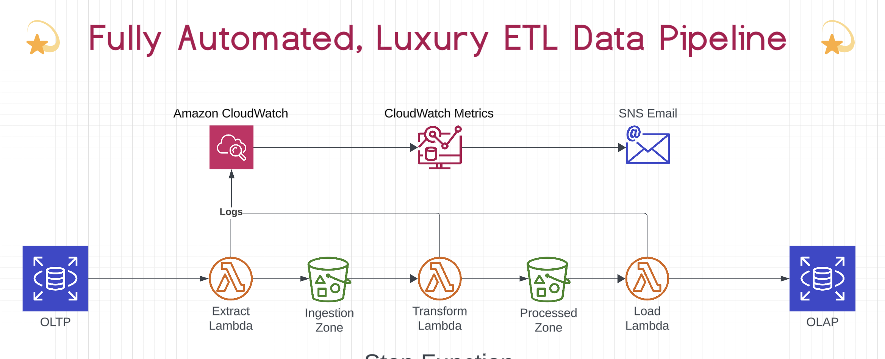

# Team Smith-Mora 
# Data Lake/Warehouse Project

A data platform that extracts data from an operational OLTP database, transforms it into denormalized structures, and then loads it as a star schema format into an OLAP database. 

## Objective

This final project for the Northcoders Data Engineering Bootcamp aims to showcase our team’s ability to collaborate effectively, adhering to best operational practices and Agile methodologies. Throughout this project, we have consolidated our learning in Python, SQL, database modeling, AWS, and infrastructure as code (IaC) . The solution is architected using AWS with Terraform, ensuring the maintenance of historical data and the implementation of a robust ETL process.  We decided to concentrate on providing a robust minimum viable product (MVP), meeting all the requirements for a subset of the data.
## The Data

The primary data source for the project is a database called totesys which simulates the backend data of a ficticious commercial application.  [The full ERD for the OLTP database](https://dbdiagram.io/d/SampleDB-6332fecf7b3d2034ffcaaa92) consists of 11 tables in a normalised structure comprising of :
- Sales_order
- design
- purchase_order
- transaction
- payment
- payment_type
- counterparty
- address
- staff
- department
- currency 

The complete OLTP system would encompass three overlapping star schemas: Sales, Purchases, and Payments. Each schema organizes data into separate tables for facts and dimensions.

To satisfy the requirements of the MVP we focused on the Sales star schema.

 - ["Sales" schema](https://dbdiagram.io/d/637a423fc9abfc611173f637)

    - fact_sales_order
    - dim_counterparty
    - dim_date
    - dim_location
    - dim_staff
    - dim_currency
    - dim_design

## Specification

1. ### Extract
A python application scheduled to ingest all data from the totesys database every 15 minutes into a .CSV file in an S3 'ingestion' bucket.

2. ### Transform 
A python application triggured automatically when it detects the completion of ingested data into the first bucket.  This application remodels the sales data into the sales star schema. The data is stored in Parquet format in an S3 'processed' bucket.  

3. ### Load 
A Python application that loads the data from the second S3 bucket into the OLAP data warehouse at defined intervals.  Maintaining full history of history to the facts table.

4. ### Visualise
A visualisation of the data is made in real-time as the application is running 

### Other Requirements
- All processes are logged and monitered in **AWS Cloudwatch** with SMS triggures in the event of failures

- good security practices are maintained , preventing SQL injection and maintaining password security.

- All Python code is thoroughly tested for security vulnerabilities with the **safety** and **bandit** packages and are **PEP8** compliant. Test coverage exceeds 90%.

- the project is deployed automatically using **Terraform** **IaC** and **GitHub Actions** CI/CD pipeline.

- Changes to the source database are reflected in the data warehouse within 30 minutes.

**Recording Update History**

A full history of all updates to facts is maintained in the OLTP warehouse. Records are kept for each change in the facts data and it is possible to querry the database for its current state and for full history of changes to the fact data. 

For a more indepth look at the structure of the project please see the [documentation](./DOCUMENTATION.md)

## Tech Stack

- Python
- PostgreSQL
- AWS (S3, Lambda, EventBridge, CloudWatch)
- Terraform
- Github Actions (CI/CD)

## Further Development

 The next stage of the project would be to apply the structure we have created for the Sales Schema, to create all three of the overlaping schemas that comprise the OLAP database with the following table schemas.

 - ["Sales" schema](https://dbdiagram.io/d/637a423fc9abfc611173f637)
    - fact_sales_order
    - dim_counterparty
    - dim_date
    - dim_location
    - dim_staff
    - dim_currency
    - dim_design

 - ["Purchases" schema](https://dbdiagram.io/d/637b3e8bc9abfc61117419ee)
    - fact_purchase_order
    - dim_counterparty
    - dim_date
    - dim_location
    - dim_staff
    - dim_currency

 - ["Payments" schema](https://dbdiagram.io/d/637b41a5c9abfc6111741ae8)
    - fact_payments
    - dim_counterpart
    - dim_transaction
    - dim_date
    - dim_currency
    - dim_payment_type

  
## Team Smith-Mora

- Sandy Jayani [@Sandyjayani](https://www.github.com/sandyjayani)

- Martin [@FloatingBrioche](https://www.github.com/@FloatingBrioche)

- Erica [@EricaC2401](https://www.github.com/@EricaC2401)

- Ren [@dkettchen](https://www.github.com/@dkettchen)

- Ed [@edcopeland](https://www.github.com/@edcopeland)

